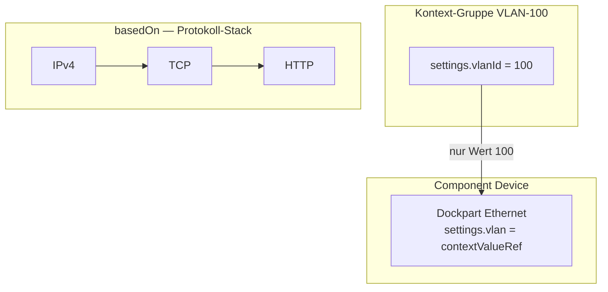

# Connection- und Stack-Architektur

Dieses Dokument beschreibt die Begriffe **Component**, **Dock/Dockpart**, **Connection/Link**, **basedOn** (Stack-Ebenen) und **Kontext** (Werte-Vererbung) im ISR-Web-Modell.

## Component (Asset)

Eine **Component** ist ein stapelbares Asset mit `definition.baseType: "COMPONENT"`. Mehrere Components bilden über `ownerIdRef` einen logischen Stack (z. B. RACK → HARDWARE → OS → APPLICATION → FUNCTION).

**Baum-Gruppen** (ViewGroup / Group) sind **keine** Components. Sie dienen der Organisation im View-Baum (Cluster, Netzwerk, VLAN-Fläche), nicht der funktionalen Stack-Ebene eines Geräts.

## Dock, Dockpart und basedOn — Protokoll-Stack

Ein **Dock** enthält **Dockparts** — das sind die eigentlichen Schichten (z. B. VLAN, Ethernet, IPv4, TCP, TLS, HTTP).

`basedOn[]` modelliert die **Protokoll-Hierarchie innerhalb oder zwischen Components**:

- **Lokal:** `dockpartId` verweist auf ein anderes Dockpart im selben Dock (IP → TCP → TLS → HTTP).
- **Cross-Component:** `componentRef` + `externalDockpartRef` verknüpft Dockparts **verschiedener Components**, damit mehrere Components gemeinsam einen vollständigen funktionalen Stack bilden.

`basedOn` bedeutet: *„Diese Schicht baut auf jener Schicht auf.“* Es handelt sich um **Verbindungs-/Stack-Ebenen**, nicht um Konfigurationswerte.

## Connection, Link, Linkpart

- Eine **Connection** enthält ein oder mehrere **Links**.
- Jeder **Link** verbindet zwei Endpunkte (`fromDockRef` / `toDockRef` im Format `dockId#dockpartId`) und optional mehrere **Linkparts** (gepaarte Schichten mit `stackOrder`).
- **Snapshots** (`fromLabelSnapshot`, `fromValueSnapshot`, `fromComponentRefSnapshot`, …) sichern Labels und Werte redundant, falls eine Component später gelöscht wird.

Ein Link kann sich über **mehrere Stack-Components** erstrecken (Modus `stackPath`), wenn From/To unterschiedliche Assets auf gleicher Stack-Tiefe verbinden.

## Kontext — Werte-Vererbung (nicht basedOn)

**Kontext ist kein basedOn und kein Component-Stack.**

Ein Device/Component kann in einer **Kontext-Gruppe** liegen (z. B. VLAN 100, Netzwerk DMZ). Daraus wird **nur ein konkreter Feldwert** übernommen — typischerweise die VLAN-ID oder eine Netzwerk-Kennung — **nicht** der gesamte Dockpart-Stack der Gruppe.

### Warum Kontext ≠ basedOn

Würde man Kontext über `basedOn` auf eine Component oder Gruppe abbilden, würden **alle** Components in diesem Kontext automatisch **alle darunterliegenden Schichten** erben. Das wäre fachlich falsch: Ein VLAN-Kontext definiert nicht den TCP/TLS/HTTP-Stack eines Servers, sondern nur den Wert „in welchem VLAN liegt dieses Gerät“.

### Modellierung

| Mechanismus | Zweck | Beispiel |
|---|---|---|
| `basedOn[]` | Protokoll-/Stack-Ebenen zwischen Dockparts/Components | HTTP basedOn TLS basedOn TCP |
| `contextMemberships[]` | Component liegt in Kontext-Gruppe(n) | Device in Gruppe „VLAN-100“ |
| `valueRef` / `contextValueRef` | Einzelnes Dockpart-Feld übernimmt Wert aus Kontext-**Gruppe** | `vlan: { kind: "contextValueRef", contextGroupRef: "…", field: "vlanId" }` |

- **Kontext-Quelle:** immer eine **Group** (`contextGroupRef`), nie eine Component.
- **Vererbung:** nur der referenzierte **Wert** (aus `Group.settings` o. ä.), keine Dockparts, keine Connection-Ebenen.
- **Positionierung:** `contextMemberships` dokumentiert, in welcher Kontext-Fläche die Component platziert ist; `valueRef`-Felder können explizit oder implizit (über Membership) auf diese Gruppe verweisen.

## Connection Wizard

- Links: eigene Component (ggf. Vorfahren-Stack).
- Rechts: durchblätterbare Kandidaten-Components.
- Protokoll-gleiche Dockparts werden horizontal markiert; Multi-Select erzeugt eine Connection mit einem oder mehreren Links.
- Geerbte **Kontext-Werte** erscheinen in aufgelösten Dockpart-**Settings**, nicht als zusätzliche geerbte Dockpart-Ebenen im Baum.

## Abgrenzung Kurzfassung

| Frage | Antwort |
|---|---|
| Liegt mein Gerät in VLAN 100? | `contextMemberships` + `contextValueRef` auf Gruppe |
| Welche Schichten hat meine Verbindung? | `basedOn` + Connection-Linkparts |
| Was passiert bei Löschung der Component? | Connection-Snapshots (Labels + Werte) |
